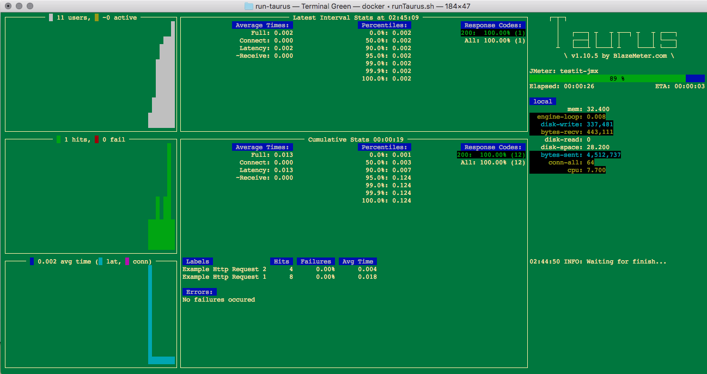

# run-taurus

A project demonstrating a load test with a Taurus jmx Jmeter project.

Other inspiration here:  (https://gettaurus.org/docs/JMeter/)

## Dependencies

Taurus requires you install Docker and then optionally Docker Toolbox in order to run the sample
  tests included in this project.

The sample tests that are included here require that you setup Apache server locally: 
    (https://medium.com/@JohnFoderaro/how-to-set-up-apache-in-macos-sierra-10-12-bca5a5dfffba)

## X DISPLAY Setup

If you correctly set your X11 display, and if enable jmeter GUI in .yml, then you will see 3 things open 
on your local host that are started from this dockerized test:
    1. A browser pointing to the test report on blazemeter if you enabled the blazemeter report Taurus plugin.
    2. A instance of Jmeter opens.
       a. Once jmeter GUI starts up, you have to execute the RUN button manually, which is useful for debugging.  You 
          must manually kill Jmeter to finish the test.

On a Mac, you can set X display if you want, from these instructions:  (https://fredrikaverpil.github.io/2016/07/31/docker-for-mac-and-gui-applications/)

On Windows, you could probably achieve the same thing using XMing X11 display, but I didn't try.

## What It Looks Like

This is what Taurus looks like when it is running.

